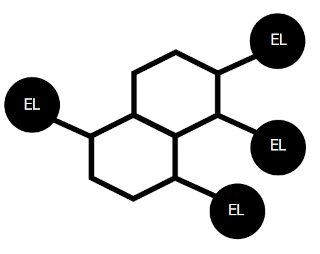

</img>

# **Dompamine**

DOM Element Manipulation Simplifier

- Simplify long syntaxes
- Change multiple elements at once
- Option to execute in a long chainned operation 

 

---

[Learn More](https://fmented.github.io/dompamine/#/./README) | [Github](https://github.com/fmented/dompamine)
|---|---|

